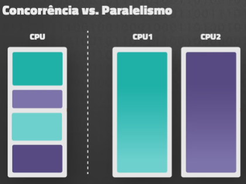

# O Que é uma Thread?

<!-- ctrl + shift + v | para ver com as formatações -->

É o subconjunto de um processo que efetivamente é executado, o que a cpu realmente executa. Por isso é necessário que processos possuam ao menos uma Thread, pois o processo é apenas um conceito organizacional de dados.

Existe o Kernel Thread e o User Thread
-> Kernel: Suportado no próprio Kernel
-> User: Camada acima do Kernel

🧠 Single-core 
-> Escalonamento de tarefas, priorizando as tarefas e fazendo um pouco de cada uma, entregando cada uma conforme forem terminando

🧠🧠🧠 Paralelismo (Processaodores multi-core)
-> Processar as tarefas ao mesmo tempo em paralelo;
-> A cpu possui a capacidade de processamento em paralelo, já que cada processador se porta individualmente.

🔧 O uso de Threads precisa ser realizado de forma inteligente, não adianta se impressionar com números sem saber o que aquilo de fato significa, e o que está fazendo. Não é porque um programa funciona com 8 Threads que ele é melhor, pelo contrário, depende do contexto da coisa toda.

<!-- "Concorrência é sobre LIDAR com várias coisas ao mesmo tempo. Parelelismo é sobre literalmente FAZER várias coisas ao mesmo tempo." Rob Pike -->

## Paralelismo
Tarefas estão realmente sendo pararelizadas entre múltiplos núcleios de processamento em um processaodor, ou distribuída entre dois ou mais processadores.

Obs: Se um Thread depende de outro para ser executado, utilizar 2, 4 ou 8 processadores não irá adiantar, é como se estivesse em um ambiente single-core.

--> Mais ligado a nivel de *Hardware*

## Concorrência
Pseudo-paralelismo. Divide a tarefa entre diferentes Threads, mas elas dividem os recursos de um processador

--> Mais ligado a nivel de *Software*

### Benefícios e Desafios das Threads

*Benefícios*
-> Capacidade de resposta mais rápida, e compartilhamento de recursos;
-> Escalabilidade;
-> Troca de tarefas de forma suave;

*Malefícios*
-> Thread Cancelation (encerrar um thread antes dele terminar de funcionar);
-> Problemas de segurança por conta do compartilhamento de recursos;

