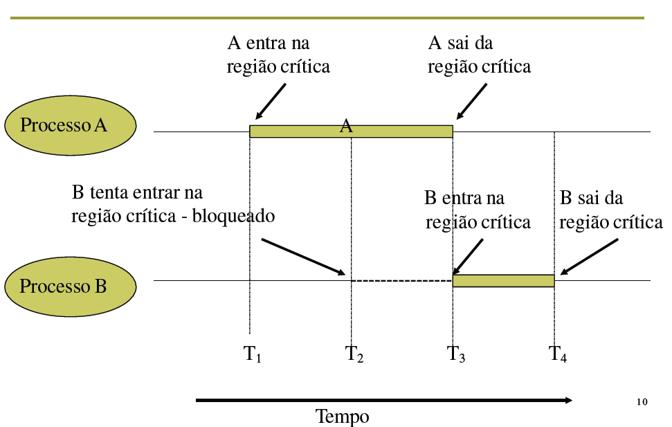

# Comunicação de processos
1. Processos precisam se comunicar entre eles  
2. Comunicação estruturada, para dar certo e não ter interrupções  
3. Como um processo passa informação ao outro?  
4. Como garantir que eles não invadam o espaço do outro, e nem entrem em conflito?  
5. Qual a sequência correta quando existe dependência entre os processos?  

## Condição de corrida
- Situação onde dois ou mais processos tentam acessar um recurso compartilhado de forma competitiva;  
- Há uma corrida pelo recurso;  
- Exemplo com p1 e p2 respectivamente, sendo p um processo: *a = d + c | x = a - y*
- A variável *'a'* é compartilhada, e nesse exemplo, o p1 deveria ser processado primeiro e comunicar para o p2 que ele poderia ser processado, mas os dois estão concorrendo ao mesmo tempo pelo menos recurso, podendo dar erro | *race condition*

### 🏃‍♂️ Exemplo de condição de corrida
1. Quando um processo deseja imprimir um arquivo, ele coloca o nome do arquivo em uma lista de impressão
2. Um processo chamado "printer daemon" verifica a lista periodicamente para verificar se existe algum arquivo para ser impresso e, se existir, ele o imprime e remove o seu nome da lista
3. Suponha que dois processos, A e B, irão enviar seus documentos para impressão

✏ De forma fácil, o 4 da imagem é o próximo arquivo a ser impresso, já o 7 aponta pro slot livre para armazenar novos arquivos a serem impressos. O processo A e B foram requisitados ao mesmo tempo.

✏ O processo A vai ler a variável "In" e vai entender que o endereço é o "7", mas o processo "B" vai fazer exatamente a mesma coisa. E agora, quem vai ocupar o slot 7?

✏ Isso vai fazer com que um processo sobreponha ao outro, e um deles vai deixar de ser executado. Isso não pode ocorrer, e é justamente com a sicronização que podemos resolver isso.

## Exclusão mútua 
Um único processo deve estar na região crítica de cada vez, impedindo que um processo sobreponha ao outro.

