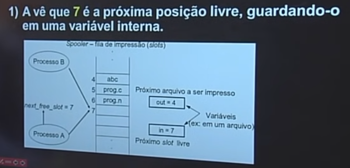
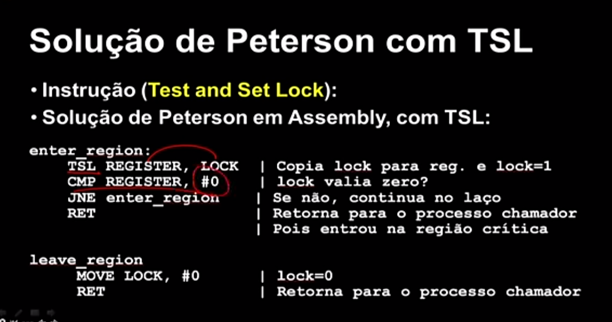

# Espera Ocupada

1. Desabilitar interrupções
2. Variáveis de travamento (Lock)
3. Estrita Alternância
4. Solução de Peterson e Instrução TSL

Se a região crítica está ocupada por um processo, então o outro processo espera, é mais ou menos essa a lógica da espera ocupada.

* Desvantagen

1. Desperdiça tempo de CPU (Ocasiona ciclo de processamento);
 
## Desabilitar interrupções

Se um processo entrar na região crítica, ele desabilita as interrupções do processador (Na prática, a desabilitação de interrupções é uma operação realizada pelo sistema operacional ou pelo hardware para temporariamente impedir que eventos externos interrompam a execução de determinado código crítico. Quando as interrupções são desabilitadas, o processador continua executando o código sem responder a solicitações de interrupção externas.)

* Com as interrupções desabilitadas, a CPU não realiza chaveamento entre os processos. Ou seja, os processos não ficam trocando entre eles até que o processo que está dentro da região crítica finalize. O chaveamento seria salvar o contexto do processo atual, restaurar o contexto do próximo processo e executar esse processo, a partir do ponto onde ele começa ou havia sido interrompido. Isso tudo causa um tempo de sobrecarga, pois requer tempo para salvar, trocar e restaurar o processo.
* Só funciona em ambientes monoprocessados (viola condição 2 - não se pode fazer suposições em relação à velocidade e ao número de CPUs)
* Em sistemas com várias CPUs, desabilitar interrupções em uma CPU não evita que as outras acessem a memória compartilhada. (Viola condição 1 - Dois ou mais processos não podem estar na região crítica ao mesmo tempo.)
* Não é uma solução segura, pois um processo pode esquecer de reabilitar suas interrupções e não ser finalizado. (Viola condição 4 - um processo não pode esperar infinitamente para entrar na região crítica)

## Variáveis de Lock

Se for 0, o processo entra. Se for 1, o processo não entra
* Apresenta o mesmo problema do anterior
* No momento que o processo A verifica que lock == 0, o processo B pode fazer o mesmo procedimento, então, dois processos podem acabar entrando na mesma região crítica (viola a condição 1)

## Alternância Explícita

* A variável turn controla de quem é a vez
* Alternância "rigorosa"
* 

## Solução de Peterson

1. Antes de entrar na região crítica
* Cada processo chama "entra_região", demonstrando seu interesse em entrar na RC
* Somente quanto "entra_região" retorna, é que ele entra.
* Ele então espera até que seja segura entrar

2. Após terminar na região crítica 
* Chama deixa região

Solução de Peterson (com TSL)

* Faz uso do hardware
* Lê o conteúdo de lock e armazena no registrador RX;
* Operação indivisível
* Bloqueia o barramento da memória

Se lock == 0, então RC "liberada"
Se lock != 0, então rc "ocupada"

